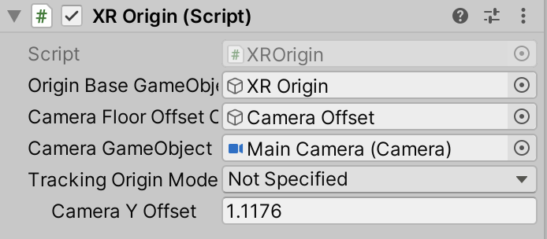
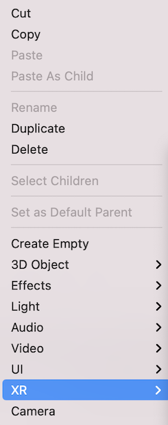
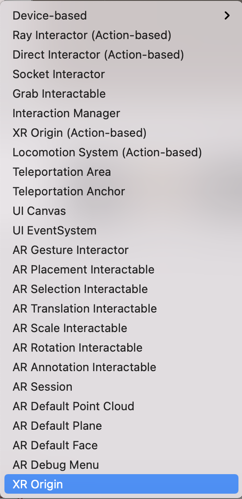
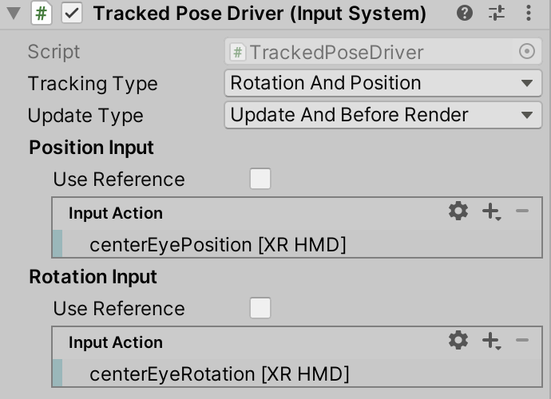
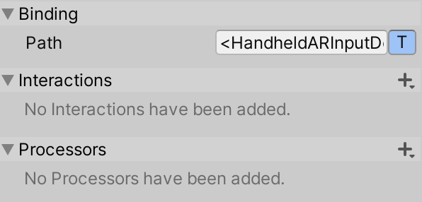

# XR Origin

The XR Origin represents the center of worldspace in an XR scene.

The purpose of the XR Origin is to transform objects and trackable features to their final position, orientation, and scale in the Unity scene. It specifies an Origin, a Camera Floor Offset Object, and a Camera.

## Adding XR Origin to Scene

To create a pre-configured XR Origin with a floor offset GameObject and camera already set up, you should right-click anywhere in the scene inspector and select **XR** &gt; **XR Origin**.

Right-click to open Scene Inspector Menu       |  Select XR Origin
:-------------------------:|:-------------------------:
  |  

For a non-configured XR Origin, add the [XROrigin](xref:Unity.XR.CoreUtils.XROrigin) component to any `GameObject`.

## How to Setup for AR

To use [XROrigin](xref:Unity.XR.CoreUtils.XROrigin) for an AR experience:
- Install [com.unity.xr.arfoundation](https://docs.unity3d.com/Packages/com.unity.xr.arfoundation@latest/index.html).
- Right-click anywhere in the scene inspector and select **XR** &gt; **XR Origin**.
- To display the camera feed onto which the AR graphics are mapped, under the `Camera` object associated with the XR Origin, attach the `ARCameraManager` and `ARCameraBackground` scripts.

## How to Setup with XR Controllers

To create a pre-configured XR Origin with controllers:
- Install [com.unity.xr.interaction.toolkit](https://docs.unity3d.com/Packages/com.unity.xr.interaction.toolkit@latest/index.html).
- Right-click anywhere in the scene inspector and select **XR** &gt; **XR Origin (Action-based)**.

Note that Action-based menu items in the XR Interaction Toolkit make use of the [InputSystem](https://docs.unity3d.com/Packages/com.unity.inputsystem@1.2/manual/Installation.html). For more about the difference between Device-based and Action-based behaviors in XRI, see the `com.unity.xr.interaction.toolkit` documentation linked above.

## How to Setup Tracked Pose Driver

In order to get position and rotation data from the XR device applied to the camera associated with the XR origin, users should add a [Tracked Pose Driver component](https://docs.unity.cn/Packages/com.unity.inputsystem@1.2/api/UnityEngine.InputSystem.XR.TrackedPoseDriver.html) from `com.unity.inputsystem`

The bindings should be as follows for an XR HMD:

- `<XRHMD>/centerEyePosition`
- `<XRHMD>/centerEyeRotation`

> [!NOTE]
> There is currently an issue with finding the bindings for Mobile AR via the component editor. To add Mobile AR support, input the following binding paths when adding a new binding to Position Input or Rotation Input respectively:
>- `<HandheldARInputDevice>/devicePosition`
>- `<HandheldARInputDevice>/deviceRotation`

