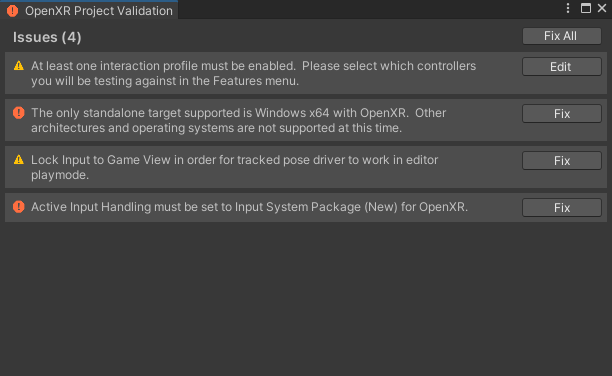
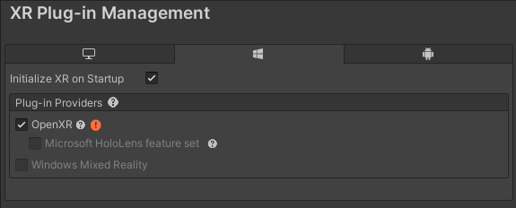
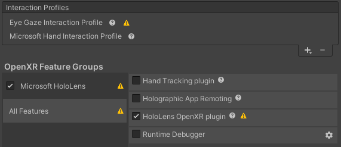
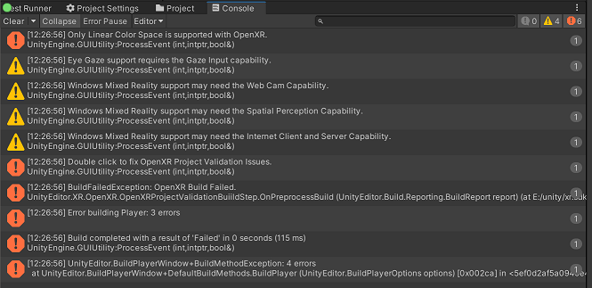
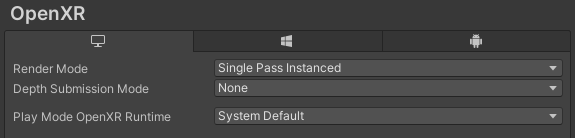
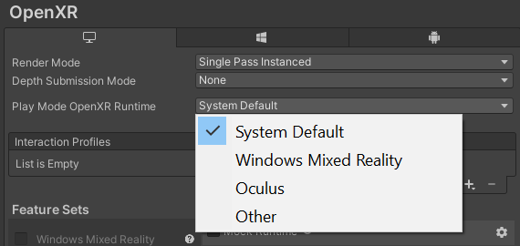
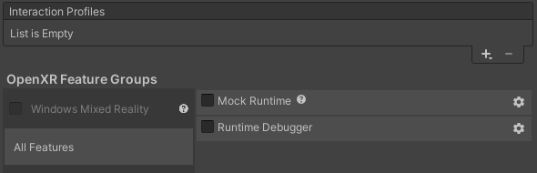

# OpenXR Plugin

OpenXR is an open, royalty-free standard developed by Khronos that aims to simplify AR/VR development by allowing developers to seamlessly target a wide range of AR/VR devices.

## Requirements

This version of OpenXR is compatible with the following versions of the Unity Editor:

* 2020 LTS+

## Runtimes

Unity's OpenXR plug-in should work with any device that supports conformant OpenXR runtimes. The following is a list of known runtimes that you may want to target:

|**Runtime**|**Build target**|**Preferred Graphics API**|**Feature Parity**|**Known Limitations**|
|---|---|---|---|---|
|Windows Mixed Reality|Windows 64-bit|DX11|Full feature parity via [Mixed Reality OpenXR Plugin for Unity](https://docs.microsoft.com/en-us/windows/mixed-reality/develop/unity/openxr-getting-started)||
|HoloLens 2|UWP arm64|DX11|Full feature parity via [Mixed Reality OpenXR Plugin for Unity](https://docs.microsoft.com/en-us/windows/mixed-reality/develop/unity/openxr-getting-started)||
|Oculus PC + Link|Windows 64-bit|DX11|HMD + Controllers|Oculus Integration package features not available|
|Oculus Quest|Android arm64|Vulkan|HMD + Controllers via [Oculus Quest Support Feature](./features/oculusquest.md)|Oculus Integration package features not available<br><br>Not yet recommended for production.|
|All other conformant runtimes (eg. SteamVR)|Windows 64-bit|DX11|HMD + Controllers|Given the unbounded combinations of possible hardware/software configurations, Unity is unable to test or guarantee that all configurations will work optimally.<br><br>SteamVR Plugin features not available|

To help the community as a whole, Unity will continue to submit any runtime issues, and contribute conformance tests and specification changes to the Khronos working group.

## Considerations before porting to OpenXR

Unity does not yet provide out-of-the-box solutions to the following when using OpenXR, however there may be platform-specific plugins (eg. [Mixed Reality OpenXR Plugin for Unity](https://docs.microsoft.com/en-us/windows/mixed-reality/develop/unity/openxr-getting-started)) or third party solutions available:

* Controller / hand models
* Finger tracking
* Augmented reality / mixed reality features
* Composition layers
* Overlays
* Foveated rendering

## Getting started

To enable OpenXR in your project, follow the steps below:

1. Open the **Project Settings** window (menu: **Edit &gt; Project Settings**), and select **XR Plug-in Management**.
2. Enable the **OpenXR** option and any **Feature Groups** for the runtimes you intend to target.
3. In the **OpenXR > Features** tab, select the interaction profile of the device you are testing with.
4. In the **OpenXR** tab, make sure the current active runtime is set to the hardware you are testing with. See the [Per-platform setttings](#per-platform-settings) section on this page for more information.


## Project validation



Unity raises errors and warnings at build time if your project is not compatible with OpenXR. Make sure that your project conforms to the following rules and standards:

* If using OpenGLES the **Color Space** must be set to Linear in the Player settings (menu: **Edit &gt; Project Settings &gt; Player**, then select your platform and change this setting under **Other Settings &gt; Rendering**). OpenXR does not support Gamma **Color Space** rendering with OpenGLES in Unity.

* You must select at least one interaction profile in the **OpenXR** tab. Unity's OpenXR plug-in includes several interaction profiles, and you can add more from the **Features** tab. For more information on interaction profiles, see the [OpenXR input](./input.md) page. 

Features might introduce new validation steps. For more information, refer to specific feature documentation. Unity does not write or maintain documentation for third-party features, nor does Unity guarantee that any third-party documentation is correct or complete. 

Unity reports validation issues in the following locations:

* XR Plug-in Management window: Icon next to the OpenXR loader.
* Features pane: Icon next to the feature group containing the feature that is reporting a validation issue.
* Features pane: Icon next to each feature that is reporting a validation issue.
* Console window, as the result of a build: Validation errors cause the build to terminate. Validation warnings do not terminate the build.

The Validation window can also be opened manually from the menu (**Window &gt; XR &gt; OpenXR &gt; Project Validation**).

### Validation issues reported in XR Plug-in Management



Clicking on either the validation warning or the error icon brings up the Validation window.

### Validation issues reported in features pane  



Clicking on either the validation warning or the error icon brings up the Validation window.

### Validation issues reported in build  



Double-clicking on build warnings or errors from validation brings up the Validation window.

## Troubleshooting

If you experience an issue, please [file a bug](https://unity3d.com/unity/qa/bug-reporting). When you do, please also check the [log file](https://docs.unity3d.com/2020.3/Documentation/Manual/LogFiles.html) to see if Unity supports the combination of OpenXR runtimes and features you are using. The log file will provide additional guidance.

Unity generates a diagnostic log in either the Player or Editor log, depending on where you run the application. The diagnostic log starts with `==== Start Unity OpenXR Diagnostic Report ====` and ends with `==== End Unity OpenXR Diagnostic Report ====` log entries. It contains information about your application, Unity version, OpenXR runtime, OpenXR Extensions, and other aspects that can help diagnose issues.

The most important part of the diagnostic log is the section marked `==== OpenXR Support Details ====`. This section provides some simple information on what parts of your application Unity supports, what it might not support, and what to do before submitting an issue or requesting assistance.

### Examples
#### Diagnostic log OpenXR Support Details section when running with Unity supported items
```
[XR] [58328] [12:54:14.788][Info   ] ==== OpenXR Support Details ====
[XR] [58328] [12:54:14.788][Info   ] OpenXR Runtime:
[XR] [58328] [12:54:14.788][Info   ]     <Some company>, which is a Unity supported partner
[XR] [58328] [12:54:14.788][Info   ] Unity OpenXR Features:
[XR] [58328] [12:54:14.788][Info   ]     Android , ControllerSampleValidation Standalone, Standalone : Unity
[XR] [58328] [12:54:14.788][Info   ] Unity Support:
[XR] [58328] [12:54:14.788][Info   ]     Unity supports the runtime and Unity OpenXR Features above. When requesting assistance, please copy the OpenXR section from ==== Start Unity OpenXR Diagnostic Report ==== to ==== End Unity OpenXR Diagnostic Report ==== to the bug or forum post.
```


#### Diagnostic log OpenXR Support Details section when running with items not supported by Unity
```
[XR] [58328] [12:54:14.788][Info   ] ==== OpenXR Support Details ====
[XR] [58328] [12:54:14.788][Info   ] OpenXR Runtime:
[XR] [58328] [12:54:14.788][Info   ]     <Some company>, which is not a Unity supported partner
[XR] [58328] [12:54:14.788][Info   ] Unity OpenXR Features:
[XR] [58328] [12:54:14.788][Info   ]     Android , ControllerSampleValidation Standalone, Standalone : Unity
[XR] [58328] [12:54:14.788][Info   ] Unity Support:
[XR] [58328] [12:54:14.788][Info   ]     Unity doesn't support some aspects of the runtime and Unity OpenXR Features above. Please attempt to reproduce the issue with only Unity supported aspects before submitting the issue to Unity.
```

## Known issues

* For projects targeting HoloLens 2 that are using Out of the Box Unity OpenXR support, **Project Settings - &gt; Player - &gt; Resolution and Presentation - &gt; Run in Background** must be enabled. For projects that are using the Microsoft OpenXR extended support package this is not required.
* An issue with an invalid stage space during startup may cause problems with the XR Rig component from the `com.unity.xr.interaction.toolkit` package, or the camera offset component in the `com.unity.xr.legacyinputhelpers` package. These packages will be updated shortly to contain fixes for this issue. Until then the workaround is to use the `Floor` Device Tracking Option setting. 

## Upgrading a project to use OpenXR

OpenXR is a plug-in in Unity's [XR plug-in architecture](https://docs.unity3d.com/2020.1/Documentation/Manual/XRPluginArchitecture.html). Unity recommends using the [XR Interaction Toolkit](https://docs.unity3d.com/Packages/com.unity.xr.interaction.toolkit@1.0/manual/index.html) for input and interactions. If you are using any platform-vendor specific toolkits, please see the platform-vendor specific documentation on how to integrate those toolkits with OpenXR. Vendors are still in the process of adding OpenXR support to their toolkits; please make sure you check supported status before enabling OpenXR in your project.

The core steps to upgrade a project to use OpenXR are the setup instructions at the top. In addition, you might need to do some of the following:

1. **Update to the latest [supported version](#requirements) of Unity before implementing OpenXR**. Some APIs that your project relies on might have been changed or removed, and this will let you easily distinguish which changes are a result of the new Unity version and which come from OpenXR.
2. **Disable XR SDK plug-ins that are also supported by OpenXR.** There is a good chance that OpenXR supports your target device, so enabling a competing XR SDK plug-in may cause unexpected behavior. In **Project Settings &gt; XR Plug-in Management**, uncheck the plug-in provider(s) for your target device(s).
3. **Update your input code** if your project doesn't use the new Input System. For more information, see the [Quick start guide](https://docs.unity3d.com/Packages/com.unity.inputsystem@1.0/manual/QuickStartGuide.html) in the Input System package documentation.
4. **Change quality settings.** It is possible that switching over to the OpenXR provider will affect your application's visual quality. You can adjust the quality settings of your project (menu: **Edit &gt; Project Settings &gt; Player**, then select the **Quality** tab) to try getting your old visuals back.

## OpenXR concepts

### Understanding OpenXR's action-based input

See [OpenXR Input Documentation](./input.md).

### Generic OpenXR Settings



#### Settings supported on all platforms
The following settings are general across all platforms in OpenXR:

**Render Mode** - Sets the requested render mode for a given platform. You can choose from the following:

|**Option**|**Description**|
|---|---|
|**Multi Pass**|When rendering, the engine will do a complete render pass (culling and rendering) for each eye.|
|**Single Pass Instanced**|When rendering, the engine will do simultaneous renders to each eye using shared culling and a single render pass.|

**Depth Submission Mode** - Sets the requested depth submission mode for a given platform. You can choose from the following:

|**Option**|**Description**|
|---|---|
|**None**|No depth submission support. No depth based stability or re-projection support that the platform my provide will be available.|
|**Depth 16 bit**|A shared depth buffer using 16 bits per pixel will be used.|
|**Depth 24 bit**|A shared depth buffer using 24 bits per pixel will be used.|

#### Per-platform settings

Standalone:



**Active OpenXR Runtime** - Sets the OpenXR runtime to be used when running your app in Play mode. This setting is only active for the current running instance of the Editor that you are using. You can choose from the following:

|**Option**|**Description**|
|---|---|
|**System Default**|The currently set OpenXR runtime.|
|**Windows Mixed Reality**|If available, sets the current OpenXR runtime to the Microsoft OpenXR runtime for Windows Mixed Reality.|
|**SteamVR**|If available, sets the current OpenXR runtime to the SteamVR OpenXR runtime.|
|**Oculus**|If available, sets the current OpenXR runtime to the Oculus OpenXR runtime.|
|**Other**|Allows you to navigate to and select the `json` file for a specific runtime. Useful when you want to use an OpenXR runtime that Unity might not directly support or detect automatically.|

### OpenXR features

Features allow third parties to extend Unity's base support for OpenXR. They bring the functionality of OpenXR spec extensions to the Unity ecosystem, but Unity is not involved in their development.

Features might integrate into the [Unity XR Plug-in framework](https://docs.unity3d.com/2020.1/Documentation/Manual/XRPluginArchitecture.html) to provide data to other XR subsystems (for example, providing meshing or plane data for AR use cases which are not yet standardized in OpenXR 1.0).

Features are a collection of Unity Assets that can be distributed through the Package Manager, Asset Store, or any other mechanism.

#### Feature selection and configuration



You can enable, disable, and configure features from the **XR Plug-in Management &gt; OpenXR** window. There are two main sections: **Interaction Profiles** and **Feature Groups** .

**Interaction Profiles** are a specific type of feature that provide support for various controllers and input devices within OpenXR.  Generally you would add **Interaction Profiles** for each device that you are able to test with and intend to support.

Feature groups are a grouping of features that a provider defines. Use them to easily select and group a number of features. Selecting group in the left pane filters the set of features on the right to only the features that the set contains. You can then enable or disable these features individually.

Some features will will have links to documentation following their name as well as a gear icon to the right for additional configuration. 

### OpenXR core features

#### General features

* Mock Runtime (**Note:** Enabling this will take over whatever current OpenXR runtime you might be using.)

#### Interaction profile features

* [Eye Gaze Interaction](./features/eyegazeinteraction.md)
* [Microsoft Hand Interaction](./features/microsofthandinteraction.md)
* [HTC Vive Controller](./features/htcvivecontrollerprofile.md)
* [Khronos Simple Controller](./features/khrsimplecontrollerprofile.md)
* [Microsoft Motion Controller](./features/microsoftmotioncontrollerprofile.md)
* [Oculus Touch Controller](./features/oculustouchcontrollerprofile.md)
* [Valve Index Controller](./features/valveindexcontrollerprofile.md)

### Accessing features at runtime via script

You can also access all the settings in the **Features** window through script. The scripting API documentation in this package provides information on all APIs you can use for feature support. The code samples below illustrate some of the common tasks.

#### Iterating over all features

```c#
    BuildTargetGroup buildTargetGroup = BuildTargetGroup.Standalone;
    FeatureHelpers.RefreshFeatures(buildTargetGroup);
    var features = OpenXRSettings.Instance.GetFeatures();
    foreach (var feature in features)
    {
        // Toggle feature on/off
        feature.enabled = ...;
    }
```

#### Getting a specific feature by type

```c#
    var feature = OpenXRSettings.Instance.GetFeature<MockRuntime>();

    // Toggle feature on/off
    feature.enabled = ...;
```

#### Iterating over all feature groups

Feature groups are an Editor-only concept and as such can only be accessed in the Unity Editor.

```c#
#if UNITY_EDITOR
    BuildTargetGroup buildTargetGroup = BuildTargetGroup.Standalone;
    var featureSets = OpenXRFeatureSetManager.FeatureSetsForBuildTarget(buildTargetGroup);
    foreach(var featureSet in featureSets)
    {
        var featureSetId = featureSet.featureSetId;
        // ...
    }
#endif
```

#### Iterating over features in a feature group

Feature groups are an Editor-only concept and as such can only be accessed in the Unity Editor.

```c#
#if UNITY_EDITOR
    var featureSet = OpenXRFeatureSetManager.GetFeatureSetWithId(buildTargetGroup, featureSetId); // featureSetId set earlier
    var features = FeatureHelpers.GetFeaturesWithIdsForActiveBuildTarget(featureSet.featureIds);
    foreach (var feature in features)
    {
        // ... Do something with the feature.
    }
#endif
```

### Implementing a feature

Anyone can add new features. To learn more, see documentation on [how to add a feature to Unity's OpenXR support](features.md).

## References

* https://www.khronos.org/openxr/
* https://www.khronos.org/registry/OpenXR/specs/1.0/html/xrspec.html
